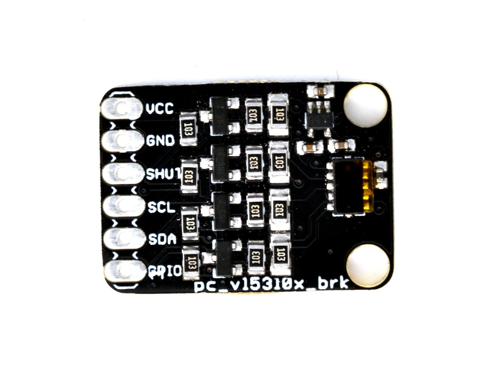

ProtoCentral VL53L0X Laser ToF sensor breakout board
====================================================
[  
*ProtoCentral VL53L0X Laser ToF sensor breakout (PC-SEN-2001)*](https://www.protocentral.com/motiondistance/1049-protocentral-vl53l0x-laser-tof-sensor-breakout.html)

[Dont have it yet? Buy one here: ProtoCentral VL53L0X Laser ToF sensor breakout (PC-SEN-2001)](https://protocentral.com/product/protocentral-vl53l0x-laser-tof-sensor-breakout/)

ST's VL53L0X is a 940 nm Laser source and a detector built in to the same chip. The result is a high accuracy Laser ranging sensor. 

This breakout board (along with the Arduino libraries) from ProtoCentral make it easier to do quick prototypes for applications that require precision ranging. Applications include obstacle detection and gesture recognition, among others. We have even used these for non-invasive liquid level detection. 

This device is a Class 1 Laser device, so is classified "Eye-safe", meaning it will not burn your corneas out !

Features
--------
* 940 nm VCSEL laser including driver
* Integrated Avalanche Photodiode
* Maximum ranging distance of up to 2 meters
* High immunity to ambient light

Includes
--------
* 1x Protocentral VL53L0X Laser tof sensor
* 1x set of breakaway headers

Repository Contents
-------------------
* **/software** - Arduino library and processing example sketch
* **/hardware** - All Eagle design files (.brd, .sch)
* **/extras** - datasheets and extras

Arduino Quickstart
------------------

* Download the [ProtoCentral VL53L0X library here](releases/download/v1.0/protocentral_vl53l0x.zip).

* Once downloaded, unzip the ZIP archive and copy the folder to your "libraries" folder in the Arduino Sketchbook folder. It is usually located in:

	* On MAC: <user_home>/Documents/Arduino/libraries
	* On Windows: <user_home>/My Documents/Arduino/libraries
	* On Linux: /home/<user_name>/sketchbook  

* After the libraries are copied, you can open the example code from File->Examples->protocentral_vl53l0x->simple_distance

* Connect the vl53l0x board to your Arduino with the following connections

	| Arduino | VL53L0X board |
	| ------- | ------------- |
	| 5V      | VIN |
	| GND     | GND |
	| SDA     | SDA |
	| SCL     | SCL |
        
Using Processing - Data Visualization Software
----------------------------------------------
 For continuous graphical data visualization as shown below, please follow the steps given in this [document](docs/using_processing.md).

License Information
===================

This product is open source! Both, our hardware and software are open source and licensed under the following licenses:

Hardware
---------

**All hardware is released under [Creative Commons Share-alike 4.0 International](http://creativecommons.org/licenses/by-sa/4.0/).**

You are free to:

* Share — copy and redistribute the material in any medium or format
* Adapt — remix, transform, and build upon the material for any purpose, even commercially.
The licensor cannot revoke these freedoms as long as you follow the license terms.

Under the following terms:

* Attribution — You must give appropriate credit, provide a link to the license, and indicate if changes were made. You may do so in any reasonable manner, but not in any way that suggests the licensor endorses you or your use.
* ShareAlike — If you remix, transform, or build upon the material, you must distribute your contributions under the same license as the original.

Software
--------

**All software is released under the MIT License(http://opensource.org/licenses/MIT).**

THE SOFTWARE IS PROVIDED "AS IS", WITHOUT WARRANTY OF ANY KIND, EXPRESS OR IMPLIED, INCLUDING BUT NOT LIMITED TO THE WARRANTIES OF MERCHANTABILITY, FITNESS FOR A PARTICULAR PURPOSE AND NONINFRINGEMENT. IN NO EVENT SHALL THE AUTHORS OR COPYRIGHT HOLDERS BE LIABLE FOR ANY CLAIM, DAMAGES OR OTHER LIABILITY, WHETHER IN AN ACTION OF CONTRACT, TORT OR OTHERWISE, ARISING FROM, OUT OF OR IN CONNECTION WITH THE SOFTWARE OR THE USE OR OTHER DEALINGS IN THE SOFTWARE.

Please check [*LICENSE.md*](LICENSE.md) for detailed license descriptions.

